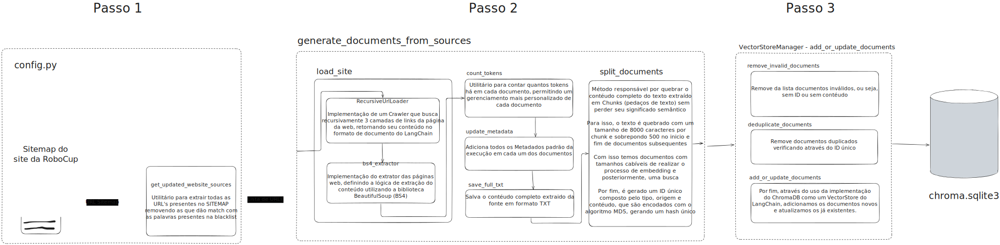

# Small Size League MCP

A comprehensive toolset designed to help developers understand and work with RoboCup Small Size League rules, software, and team information. This project provides tools for processing, storing, and querying league documentation and resources.

## Features

- Automated website source management
- Document processing and text extraction
- Vector-based document storage and retrieval
- MCP Server provisioning

## Requirements

To run this project locally, you will need:

- [UV](https://astral.sh/uv/) for Python package management
- [Ollama](https://ollama.com) for LLM providers
  - [gemma3](https://ollama.com/library/gemma3) for text generation (LLM)
  - [nomic-embed-text](https://ollama.com/library/nomic-embed-text) for text embedding
  - You can also change the providers directly through the [`providers.py`](./providers.py) file.

## Quickstart (with Makefile)

```bash
# Install dependencies (if not done)
uv venv && source .venv/bin/activate
uv sync

# Start the dev server (auto-reloads on changes)
make dev

# Or run the production server
make server

# Run the client tester
make test_client

# Launch the inspector (for debugging, requires npx)
make inspector
```

## Add into MCP Clients (Cursor, Windsurf, etc.)

There are two different options to load the project content into the MCP clients:

### Adding just the documents raw text as a source using [mcpdoc]

- This option is useful if you want to load the documents directly into the MCP client without any processing or running the full project locally
- Does not need to download or setup anything, just put the command in the MCP client
- The command below will load the documents from the `data/full_website.txt` file, which is generated by the `update-documents` command
- 

```json
"small-size-league-docs-mcp": {
      "command": "uvx",
      "args": [
        "--from",
        "mcpdoc",
        "mcpdoc",
        "--urls",
        "Small_Size_League_Docs:https://raw.githubusercontent.com/brunoocastro/small-size-league-mcp/refs/heads/main/data/full_website.txt",
        "--transport",
        "stdio",
        "--port",
        "8081",
        "--host",
        "localhost"
      ]
    }
```

### Adding the project as a MCP server providing different tools and resources

- This option is useful if you want to run the project locally and use the MCP server to provide different tools and resources
- The command below will run the `mcp.py` file, which is the main entry point for the MCP server
- This MCP server will provide:
  - full text of the website documents
  - full urls list
  - semantic search through the vector database

```json
"small-size-league-mcp": {
      "command": "uv",
      "args": [
        "run",
        "--with",
        "mcp",
        "mcp",
        "run",
        "<LOCAL_PATH>/mcp.py"
      ]
    }
```

> PS: <LOCAL_PATH> relates to the path where the MCP server is located and the `mcp.py` file is located. You can use the `pwd` command to get the local path of the current directory.
> PS2: To run the project you must (at least) uv installed and mcp command. Check the session setup below


## Setup

This project uses UV for Python package management. Follow these steps to set up the project:

1. Install UV (if not already installed):
```bash
curl -LsSf https://astral.sh/uv/install.sh | sh
```

2. Clone the repository:
```bash
git clone https://github.com/brunoocastro/small-size-league-mcp.git
cd small-size-league-mcp
```

3. Create and activate a virtual environment:
```bash
uv venv
source .venv/bin/activate  # On Linux/macOS
# or
.venv\Scripts\activate  # On Windows
```

4. Install dependencies:
```bash
uv sync
```

## Development/Management Available Commands

### Full pipeline overview



The project provides several commands through `main.py`:

### Update Website Sources
```bash
python main.py update-sources [--sitemap-url URL] [--output FILE]
```
Updates the list of website sources from the sitemap. By default, it uses the official Small Size League sitemap.

### Update Documents
```bash
python main.py update-documents [--sources FILE]
```
Processes the website sources and extracts document content. The default sources file is `processed_urls.txt`.

### Update Database
```bash
python main.py update-database --documents DOC1 [DOC2 ...]
```
Updates the vector database with processed documents.

### Test Vector Store
```bash
python main.py test-vector-store [--query "Your query"]
```
Tests the vector store with a sample query. Default query is "How to submit a paper?"

### Run All Updates
```bash
python main.py run-all [--query "Your query"]
```
Executes all update commands in sequence and tests the vector store with the provided query.

## Project Structure

- `main.py`: Main command-line interface
- `config.py`: Configuration settings
- `db_management.py`: Database management utilities
- `text_handler.py`: Text processing utilities
- `website_sources.py`: Website source management
- `providers.py`: LLM provider configurations

## Contributing

Contributions are welcome! Please feel free to submit a Pull Request.

## License

This project is licensed under the terms specified in the LICENSE file.
